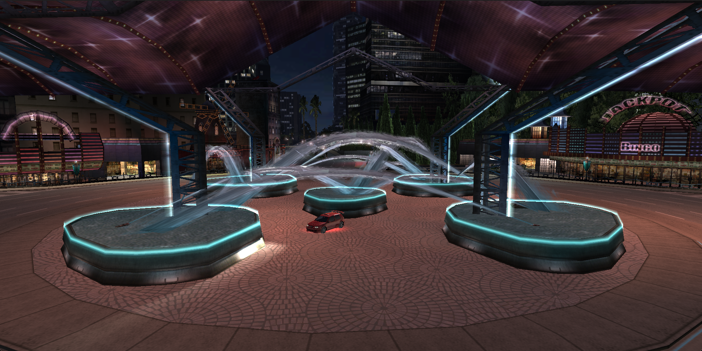
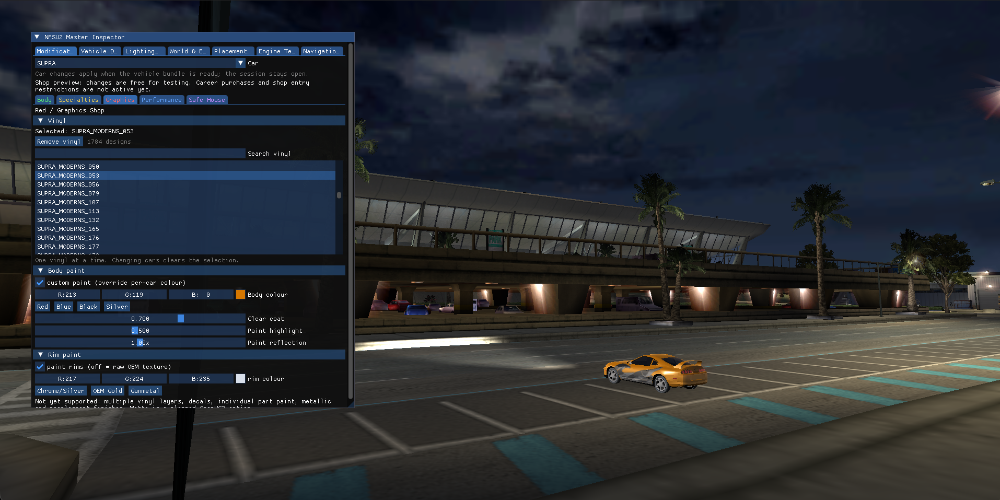
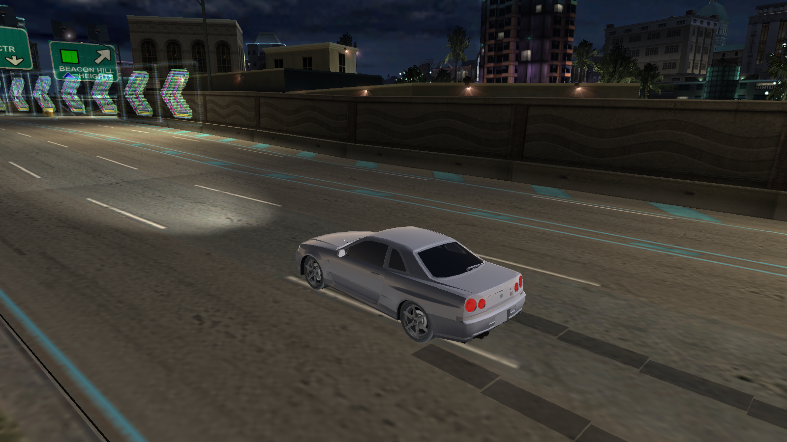
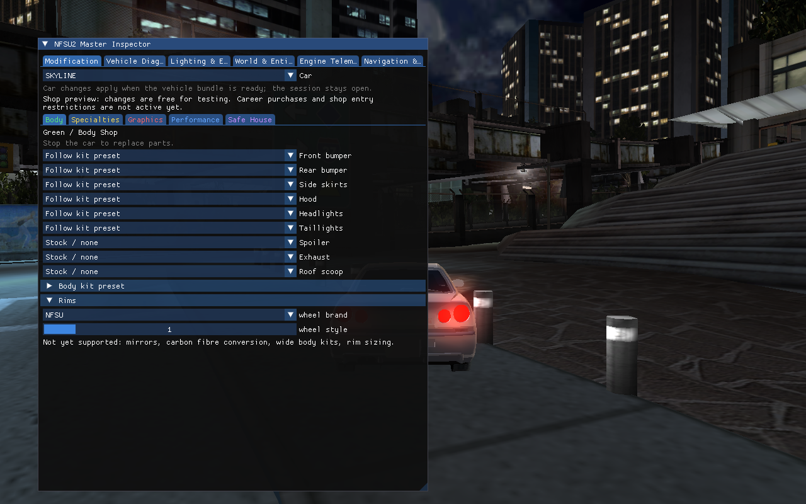
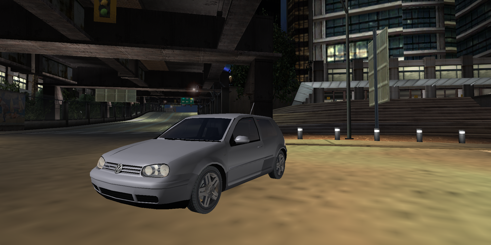
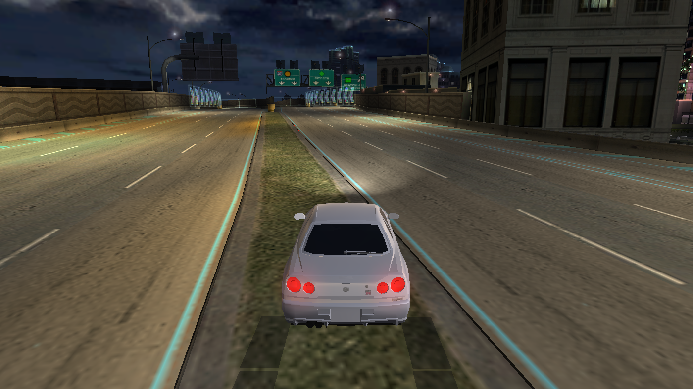
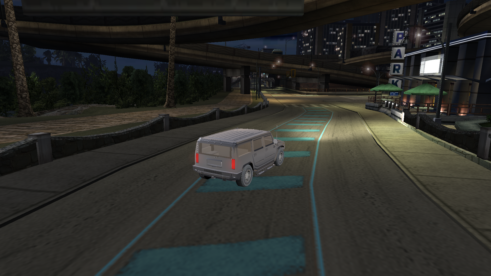
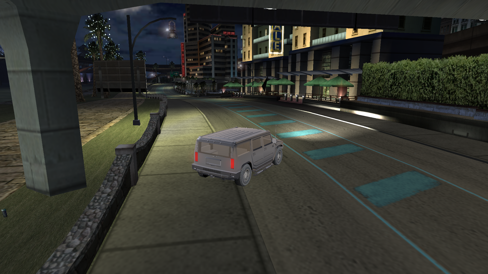
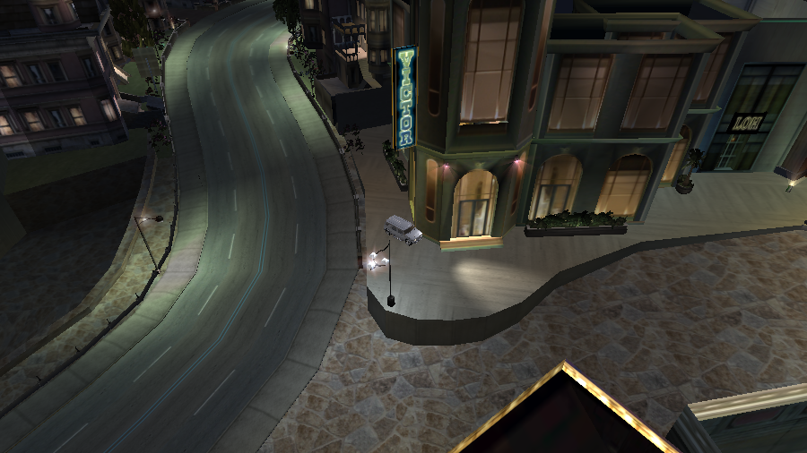
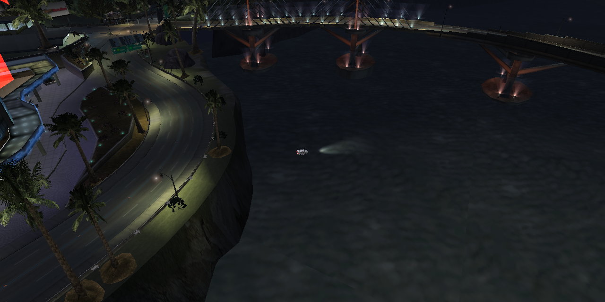

# OpenUG2

> **Help wanted across the whole project.** OpenUG2 has grown beyond what one
> maintainer can reasonably research, implement and test alone. Contributors
> and future maintainers are welcome across asset formats, rendering, physics,
> racing, AI, tooling, documentation and platform support. See
> **[Help Wanted — community roadmap #5](https://github.com/whoismept/OpenUG2/issues/5)**
> and the [contribution areas below](#help-wanted), or join the
> **[community Discord](https://discord.gg/AMnqueXe)**.

An open, from-scratch reimplementation of the **Need for Speed: Underground 2**
engine. It reads the *original* game's data files directly — no Wine, no box64,
no x86 emulation — parses the geometry, textures and racing lines, and runs a
native racing scene: a textured car you drive around a real circuit against AI
opponents, with laps and standings.

Portable across **x86 and ARM** (Linux, macOS, Windows; desktop OpenGL and
OpenGL ES). In the spirit of OpenMW / OpenRW / OpenRCT2: **the engine is open
source; you bring your own copy of the game.**

> ⚠️ OpenUG2 contains **no game assets** and no EA code. You need a legally
> acquired copy of NFS: Underground 2 and point the engine at its data
> directory. Not affiliated with, authorized, or endorsed by Electronic Arts —
> see [Legal Notice & Disclaimer](#legal-notice--disclaimer).

## Project status

OpenUG2 is an **early clean-room engine prototype**, not yet a finished or
drop-in replacement for the original game. The asset → render → drive → race
pipeline works, but only selected content has been verified end to end.

### Current development screenshots

Recent runtime captures of vehicle detail, texture filtering, the modification
UI and world lighting. These show work in progress; fountain animation, sea
quality and shop-light visibility still need further work.

| City plaza | Red shop vinyl selection |
| --- | --- |
|  |  |

| Vehicle detail | ImGui modification menu |
| --- | --- |
|  |  |

|  Vehicle detail | Road detail |
| --- | --- |
|  |  |

| Street lighting — first view | Street lighting — second view |
| --- | --- |
|  |  |

| Building sign and street materials | Waterfront and bridge |
| --- | --- |
|  |  |


Known defects are tracked alongside the progress. For example,
[#6](https://github.com/whoismept/OpenUG2/issues/6) documents a reproducible
world-surface artifact with its own capture and acceptance criteria.

### Working today

In a debug build, open **Modification → Graphics (Red shop) → Vinyl** to
search the current car’s designs, apply one immediately or remove it with
**None**. The catalogue matches `--vinyl list`; `--vinyl NAME` still selects
a design at launch. Changing cars clears the vinyl and loads that car’s catalogue.

- **Track assets** — parses `STREAM*.BUN` scenery and object transforms, emits
  road/terrain material ranges per submesh, resolves regional and shared TPK
  textures, and batches the result for OpenGL. L4RA and L4RB are the current
  single-region reference maps.
- **Scene recovery** — corrupt source vertices no longer delete an otherwise
  valid object wholesale. This restores shipped traffic, warning, median and
  airport signs at their authored transforms.
- **Car rendering** — loads `GEOMETRY.BIN` and `TEXTURES.BIN`, selects real
  per-part material slots and UVs, and renders body paint, glass, lights,
  badges and other parts without the old forced-black roof treatment.
- **Vehicle contact** — four wheel locations probe the world independently and
  feed a sprung body-height/orientation model. Walls use a mesh narrow phase
  and resolve along the contacted face instead of an enclosing AABB axis.
- **Stance** — every car now ships lowered by default. The clearance limit is
  measured against the body shell alone; the rim and brake slices reach hub
  height, and counting them made the engine think each car was already on the
  deck, so nothing could be lowered. Tyres stay on the road surface, and
  Vehicle Diagnostics → *body lowering* still tunes it per car.
- **Vehicle modification** — body parts, full kits, rims, paint, rim paint and
  neon are selectable live from the ImGui developer menu, with per-car asset
  inventories and reversible stock fallbacks.
- **Driving** — keyboard-controlled arcade acceleration, braking, steering,
  handbrake and surface-dependent grip. Per-car source records provide mass,
  torque, gearbox and steering values; measured geometry supplies lateral grip
  and load transfer.
- **Open-world traffic** — traffic and roaming racers follow authored road
  points through steering and speed targets. Player and AI share suspension,
  airborne momentum and landing response; the camera reacts to landing impact.
  Spawns require road support, clearance and an off-screen location.
- **Racing** — closed-circuit loading and AI racing-line opponents work on the
  verified L4RA route. L4RB sprint event 4201 starts on its shipped supported
  grid and its three checkpoints can complete end to end under the route
  driver.
- **World visibility** — production uses the `ordinary` tier, whose view range
  follows the active fog (about 933 m with the current settings). Developer UI
  and provisional HUD elements are hidden by default and toggled with `1`.

### Major gaps

- Vehicle handling is still an arcade approximation, not NFSU2-equivalent.
  Stock mass, RPM limits, torque curve, steering response and drivetrain, plus
  four source power/gearbox levels, are read from each car's
  `GLOBAL/GLOBALB.BUN` record. The engine does not yet simulate a full
  drivetrain or decoded brake, tyre and suspension upgrade packages.
- Traffic junction selection, route-end queues and collision impulses remain
  provisional. Short deterministic drives pass, but long-session traffic flow
  and retail handling fidelity are not yet established.
- Only selected L4RA/L4RB content is gameplay-tested. Other region bundles and
  eight remaining L4RB sprint events still need systematic coverage.
- Sprint AI opponents, the in-game driving/race HUD semantics and a
  production-quality front end are missing.
- Some race-specific `ZCV_`/`ZCS_` set-dressing definitions are decoded without
  a proven world-placement or mesh-linkage rule.
- The experimental `--tier full` panorama pass still exposes opaque authored
  backdrop sheets as hard-edged bands at some headings. It is not the default.
- Vehicle presentation still needs a complete tyre/rim render pass and
  further visual validation across cars. The misplaced stock spoiler is now
  attached to its trunk socket. The ImGui modification
  flow now covers bumpers, skirts, hoods, spoilers, exhausts, lights, full body
  kits, rims, paint, neon and a searchable vinyl catalogue in the Red / Graphics
  shop. Multiple vinyl layers, decals, mirrors, wide-body kits, rim
  sizing and individual performance packages are still missing, as are ownership,
  money, purchases and saving.
- Lighting fidelity is still evolving: installed headlight/taillight styles now
  scale emissive output, `L`/`J` drive low/high and flash beams, and `N` gives a
  small nitro headroom with stretched tail glow and soft screen-corner haze.
  Street/district lamps now draw as camera-facing flares of near-constant screen
  size instead of the authored 10 m influence radius, which used to intersect
  the lamp post, the ground and nearby walls and leave hard-edged bright slabs
  wherever the depth test cut the quad. The authored light shafts no longer
  render as solid black wedges hanging off the buildings: their
  `SFX_LIGHT_BEAMA` texture does not decode from the offset its record names,
  and an untextured world batch is now skipped instead of drawn as a flat grey
  slab. Recovering that texture's real data offset is still open. Road-closure lights
  still need material/group attribution, and the NFSU2-style wet/rainy asphalt
  path is not yet implemented.
- Open-world collision attribution still needs to classify overlapping or
  duplicate instance meshes before any collision threshold is changed.
- The northern mountain-road route needs a source-level visibility audit; after
  that, the selected-route direction arrow must be recovered from authored
  route/HUD data rather than guessed from the diagnostic map.
- `--track ALL` currently unions incompatible city/event bundles that overlap
  in the same coordinates. It is useful for research, but is **not a valid
  playable open-world composition**.

Developer references:

- [`docs/DEVELOPER_GUIDE.md`](docs/DEVELOPER_GUIDE.md) — architecture,
  ownership, runtime data flow, invariants, tests and agent workflow.
- [`docs/FORMATS.md`](docs/FORMATS.md) — evidence-labelled file layouts,
  parser contracts and clean-room format notes.
- [`docs/VEHICLE_CUSTOMIZATION.md`](docs/VEHICLE_CUSTOMIZATION.md) and
  [`docs/GAME_FLOW.md`](docs/GAME_FLOW.md) — the shop/modification surface and
  the retail game-flow contract behind it.

## Build

Needs **SDL2** and **zlib**.

```sh
# macOS:  brew install sdl2
# Debian/Ubuntu:  sudo apt install libsdl2-dev zlib1g-dev

make                 # desktop build -> ./nfsu2
make gles            # OpenGL ES 2.0 build (embedded/mobile ARM)
make debug           # desktop build + Dear ImGui developer menu (dev only)
```

> ⚠️ **Customization, modifications and engine internals live behind
> `make debug`.** A plain `make` build compiles the panel out completely: `1`
> only toggles the provisional pixel-font HUD, and there is no way to reach the
> shops or diagnostics. If you want to change rims, body kits, paint, neon or
> lighting, or inspect anything the engine has parsed, you **must** build with
> `make debug` and open the panel with `1`. See
> [Developer menu (ImGui)](#developer-menu-imgui) below.

Cross-compiling for another ARM target is just the compiler swap, e.g.
`CC=aarch64-linux-gnu-gcc make gles`.

## Developer menu (ImGui)

Build with **`make debug`**, run the engine, then press **`1`** to open the
**NFSU2 Master Inspector** (Dear ImGui, vendored under `third_party/`). This is
where every modification, diagnostic and tuning control lives. Plain `make`
builds compile the panel out entirely, so none of this is reachable there —
`1` gives you only the provisional viewport HUD.

| Tab | What you get |
| --- | --- |
| **Modification** | The vehicle shop surface. Live car selector (swaps the vehicle without restarting the world or losing your pose) plus colour-coded Underground 2 shop subtabs. |
| **Vehicle Diagnostics** | Per-car wheel stance (axle, track, ride, body lowering), live handling readouts, engine-cover and car-part inspection, mesh inspector, wheel spin/steer demo. |
| **Lighting & Environment** | Night mode, headlight beam preview, beam pitch/reach/intensity, lens opacity, headlight shadows, street/district flare size and brightness, chase-camera distance/height/stiffness, ambient/diffuse/fog. |
| **World & Entities** | Loaded track selector, scenery semantics census, nearby world chunks, decoded `ZCV_`/`ZCS_` entity definitions, UV checker, HUD toggle. |
| **Placement Marks** | Report a misplaced object by driving to it. Live probe readout (world XYZ, the ground selector's surface height and category, the covering chunk's asset name, district), then `F9` marks the defect and `F10` marks where it should be. Marks carry a note, list colour-coded, and go to the clipboard or `placement_marks.txt` — and every mark is echoed to stdout, so nothing is lost if the session ends. |
| **Engine Telemetry** | FPS and frame time, draw calls, car/track mesh counts, active district, camera and car coordinates, heading and speed, freecam. |
| **Navigation & Races** | Top-down nav graph drawn from the authored route files, district colouring, right-click GPS routing, the shipped race-event catalog, and freeroam/race mode switching with a live race HUD. |

The Modification subtabs follow the retail shop colours:

| Subtab | Working today |
| --- | --- |
| **Body** (green) | Front/rear bumpers, skirts, hood, headlight and taillight assemblies, spoiler, exhaust, roof scoop; full body-kit presets; wheel brand and rim style from the `CARS/WHEELS` library. |
| **Specialties** (yellow) | Trunk audio, neon underglow (on/off, colour, intensity). |
| **Graphics** (red) | Body paint with clear-coat, highlight and reflection controls; rim paint with chrome/OEM/gunmetal presets. |
| **Performance** (blue) | Source power-curve and transmission levels, applied live; exact ECU/engine/turbo product mapping and the remaining packages are still being decoded. |
| **Safe House** (purple) | Read-only list of installed parts; ownership and saving are not implemented. |

Changes are free and instant — this is a preview surface, not career progression.
Parts a car does not ship are shown as unavailable rather than substituted, and
you have to stop the car before swapping parts. Full design notes are in
[`docs/VEHICLE_CUSTOMIZATION.md`](docs/VEHICLE_CUSTOMIZATION.md) and
[`docs/GAME_FLOW.md`](docs/GAME_FLOW.md).

For reproducible documentation captures, `--devui` opens the panel at launch so
`--shot` can grab it:

```sh
./nfsu2 DATA --car SKYLINE --devui --chase 8,1.6 --shot docs/panel.png
```

## Run

Point it at your NFS: Underground 2 data directory (the folder containing
`TRACKS/`, `CARS/`, …):

```sh
./nfsu2 /path/to/nfsu2/data
# or:
make run DATA=/path/to/nfsu2/data
```

The normal command opens the current L4RA open-world reference. The engine
derives a start district from the selected STREAM bundle and places the car on
the nearest safe authored road; no internal world-mode or spawn flag is needed.

```sh
# Open-world reference (STREAML4RA is the default)
./nfsu2 DATA

# Another single-region world / sprint reference
./nfsu2 DATA --car ECLIPSE --track STREAML4RB --event 4201

# Closed-circuit reference (uses the currently verified circuit loader)
./nfsu2 DATA --car HUMMER --track STREAML4RA \
  --circuit ROUTESL4RA/Paths4175.bin
```

- `--car NAME` — a folder under `CARS/` (needs a `GEOMETRY.BIN`).
- `--track NAME` — a single `STREAM*.BUN` under `TRACKS/`, such as
  `STREAML4RA` or `STREAML4RB`. Selecting one automatically enables the
  instance-driven moving neighborhood. `ALL` still exists for diagnostics but
  is not a supported gameplay composition.
- `--circuit PATH` — a closed-loop `Paths*.bin` under `TRACKS/`.
- `--event ID` — start a shipped race event such as L4RB sprint `4201`.
- `--tier ordinary` — production renderer and the default. `--tier full` is an
  experimental panorama path with known visual defects.
- `--chase D,H` — chase-camera distance and height in metres, e.g. `--chase 9,1.8`.
  Useful for framing captures without touching the ImGui sliders.
- `--devui` — open the developer menu at launch (`make debug` builds only), so a
  `--shot` capture includes the panel.

The old `--world2` option remains accepted for scripts, but it is now only a
backward-compatible alias. `--spawn start|X,Y` and `--heading DEG` are developer
overrides for reproducible audits; ordinary players and new contributors do not
need them.

It boots directly into the selected authored free-roam pose. The temporary
three-entry menu was removed because it was not the retail Underground 2
frontend; the asset-backed menu is documented in
[`docs/FRONTEND_ASSETS.md`](docs/FRONTEND_ASSETS.md) and is the next frontend
milestone.

**Controls:** driving — `W`/`S` throttle/brake, `A`/`D` steer, `Space` handbrake (breaks rear
grip for drifts), `F` freecam (WASD move · hold right-mouse or arrows to look ·
`E`/`Q` up/down · `Shift` faster), `L` high beam, `J` headlight flash (open-world
racer invite), `N` nitro, **`1` developer menu** (the ImGui Master Inspector, in
`make debug` builds), `F6` cycle rim style
(once per press), `K` cycle body kit, `Esc` quit. Cars
collide and building contact is confirmed against source mesh faces before the
car is pushed. `--shot out.png` renders one frame to a PNG and exits.

The default resolution is **1920×1080**. Screenshots and visual race/drive audits
render in a hidden, fixed-size GL window, so desktop window limits do not shrink
the PNG. Use `--resolution 3840x2160` for 4K captures, or `--resolution 960x600`
for older reference dimensions. An unsupported capture size fails explicitly.
Interactive windows remain resizable and may be constrained by the display;
the log reports the actual drawable size. Existing capture scripts inherit the
1080p default. `make render-resolution-test DATA=..` checks real PNG dimensions
(requires game data and a working GL display).

## Layout

```
src/
  main.c      orchestrator: setup, game loop, input, race flow, HUD
  nfsu2.h     single-header asset parser (chunk formats — the ground truth)
  world.*     World: region scene assembly, texture binding, per-mesh bounds
              for culling, grid-accelerated ground/contact queries
  render.*    Renderer: GL objects, shaders, matrices, bitmap font, screenshot
  physics.*   car kinematics (real units, NFSU2-tuned), wall + car collision
  ai.*        racing-line opponents, circuit loading
  audio.*     procedural engine/road/skid synth (no audio assets)
  resource.*  file mapping + track/car/circuit discovery
  debug.*     optional Dear ImGui dev overlay (`make debug`)
  world_mesh.* batch uploader for the world render debug pipeline
  attrib.h    generic GLOBAL AttribSys diagnostic reader
tools/   Python utilities used to reverse-engineer & inspect the data formats
docs/    engine/developer guide and evidence-labelled format reference
```

## Project direction

Current execution order starts with the vehicle and its player-facing systems,
then moves outward to world correctness and race systems:

1. **Vehicle foundation and presentation** — complete tyre/rim rendering,
   validate stock spoiler attachments, and verify body transforms,
   wheel/contact placement and measured handling behaviour.
2. **Vehicle operations and modification flow** — the Modification tab and its
   Body, Performance, Graphics and Car Specialties subtabs exist, and vehicle
   assets swap without restarting the world. What is left: persistent per-car
   selections, ownership/money/saving, multiple vinyl layers and decals, and real performance
   packages. See the
   [customization and in-place switching design](docs/VEHICLE_CUSTOMIZATION.md)
   and the [game flow reference](docs/GAME_FLOW.md).
3. **Vehicle/world lighting fidelity** — verify model-derived headlight transforms
   and grounded neon first, then attribute district/fixture lights, road-closure guidance
   lights and the measured wet/rainy asphalt path.
4. **Open-world collision attribution** — classify overlapping/duplicate
   instance meshes and false barriers before changing collision thresholds.
5. **Northern mountain-road visibility** — recover the missing ROAD/TERRAIN
   coverage and verify route continuity without hiding the gap with draw range.
6. **Route guidance** — recover the selected-route direction arrow from the
   authored route/HUD data after the underlying road coverage is trustworthy.
7. **Production race opponents** — add and validate AI opponents on L4RA first,
   then L4RB sprint events, with race-state and HUD evidence.
8. **In-game driving frontend** — add the production HUD for speed/RPM/gear
   gauges, mini-map/route state, race position and open-world money visibility;
   money must be hidden while an active race HUD is shown.
9. **Retail front end** — integrate the decoded menu assets and flow after the
   vehicle, world-render, gameplay and in-game HUD foundations above are stable.

Each item needs a focused issue, evidence and an acceptance test. The existing
physics discipline still applies: replace a stand-in only when the source field
or a clear behavioural requirement is understood. `ALL` is not the reference
playable map; revisit its bundle composition only after individual regions are
correct.

## Help wanted

OpenUG2 needs contributors and maintainers across the **entire project**. Its
reverse engineering, engine work, validation and platform coverage are too
broad for one person to sustain alone. Start with
**[Help Wanted — community roadmap #5](https://github.com/whoismept/OpenUG2/issues/5)**,
or open a focused issue before beginning a large change.

Join the **[OpenUG2 community Discord](https://discord.gg/AMnqueXe)** to follow
development, share feedback, ask questions and coordinate contributions.
Developers, testers, documentation writers and curious NFS fans are welcome;
you do not need to write code to help. Keep reproducible bugs and proposed
changes in GitHub issues so they remain easy to track.

High-value contribution areas:

- **Formats and asset pipeline** — document unknown chunks, animated `ANM_*`
  data, race set-dressing placement, texture/material records and safe parser
  fixtures.
- **World and rendering** — verify individual bundles, restore missing authored
  scenery including the northern mountain roads, improve visibility/culling,
  and identify the structural rule behind panorama, detail-tier and lighting
  selection.
- **Vehicle dynamics** — tyre/contact behaviour, weight transfer, drivetrain
  and powertrain data, suspension presentation and NFSU2-style camera feedback.
- **Racing and AI** — production race opponents on the verified circuit and
  sprint paths, route following, event coverage, respawn/recovery, race HUD
  semantics and start/finish flow.
- **Front end, audio and usability** — in-game driving/race HUD, a real menu
  flow, settings, controls, sound design and accessible diagnostics.
- **Portability and quality** — OpenGL ES, Windows/Linux/ARM coverage,
  deterministic parser/physics tests, profiling, documentation and reproducible
  bug reports.

### Contribution rules

- This is a **clean-room reimplementation**. Never commit or paste EA assets,
  executables, decompiled/disassembled output, copyrighted game code or data
  extracted from a retail installation.
- Keep changes small and evidence-driven. Measure the production path before
  changing it; audit-only work must not silently alter behaviour.
- Document newly proven format facts in [`docs/FORMATS.md`](docs/FORMATS.md).
- Keep architectural changes and subsystem invariants current in
  [`docs/DEVELOPER_GUIDE.md`](docs/DEVELOPER_GUIDE.md).
- Build with zero warnings, keep the boot self-tests passing and keep
  `make gles` compiling.
- Include deterministic evidence: parser/test output for data changes and
  same-pose before/after PNGs for rendering changes.
- Do not treat `--track ALL` as proof of valid placement or gameplay.

## Credits

Format reverse-engineering builds on prior community work, used as references
(all code here is independent):

- **[yugecin/nfsu2-re](https://github.com/yugecin/nfsu2-re)** — a superb, detailed
  NFSU2 reverse-engineering project; the chunk-container format was confirmed
  against its [documentation](https://yugecin.github.io/nfsu2-re/docs.html).
  Big thanks for the great work.
- **[Nikki](https://github.com/SpeedReflect/Nikki)** — TPK / texture header reference.
- **[OpenNFSTools](https://github.com/MWisBest/OpenNFSTools)** — JDLZ algorithm reference.
- **[PryHUB](https://github.com/bdrtr/PryHUB)** — GLOBALB car-record and
  powertrain-upgrade layout reference, revalidated against the local retail data.
- **[vgmstream](https://github.com/vgmstream/vgmstream)** — Gnsu20 / EA-XAS v0 format reference.
- **[noclip.website](https://github.com/magcius/noclip.website)** — Jasper St.
  Pierre (magcius) and contributors, especially the
  [Need for Speed: Most Wanted viewer](https://github.com/magcius/noclip.website/tree/main/src/NeedForSpeedMostWanted).
  Its separation of model identity, instance placement and region loading
  informed our Underground 2 placement investigation. Thank you for making
  this work publicly available. Used as a research/architecture reference,
  not copied code: U2 layouts and the implementation are independently checked
  against U2 data. Reference revision and scope are recorded in
  [`docs/FORMATS.md`](docs/FORMATS.md#instance-driven-world-districts-0x341xx).

See [`docs/FORMATS.md`](docs/FORMATS.md) for details.

Bundled dependency (dev builds only): **[Dear ImGui](https://github.com/ocornut/imgui)**
by Omar Cornut — MIT-licensed, vendored under `third_party/imgui/`.

## Legal Notice & Disclaimer

OpenUG2 is an open-source, non-profit game engine recreation project built from
scratch using OpenGL. It does not contain any copyrighted material, assets, or
original code from Electronic Arts (EA). To run this engine, users must possess
a legally acquired copy of Need for Speed Underground 2. "Need for Speed" and
"Underground" are registered trademarks of Electronic Arts. This project is not
affiliated with, authorized, or endorsed by Electronic Arts.

The engine reads the formats of an existing game you already own, in the spirit
of interoperability projects like OpenMW and OpenRW — it ships **no** game data
(models, textures, audio, maps, or `speed2.exe`); you supply your own. All such
files are excluded from the repository (see [`.gitignore`](.gitignore)).

### Licensing

- OpenUG2 engine code is **MIT-licensed** — see [`LICENSE`](LICENSE).
- Bundled dependency **Dear ImGui** (dev builds only) is MIT-licensed — see
  [`third_party/imgui/LICENSE.txt`](third_party/imgui/LICENSE.txt).
- The reverse-engineering references credited above are independent third-party
  projects; no code from them is copied here.
