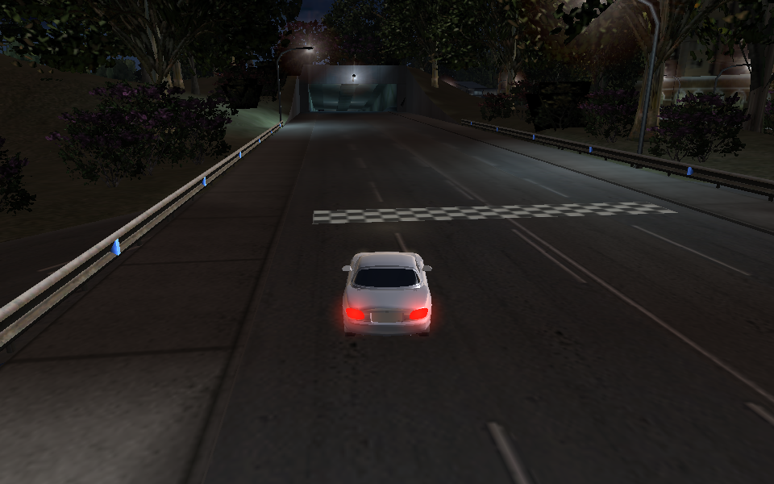
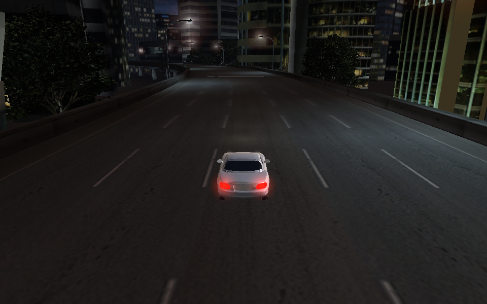
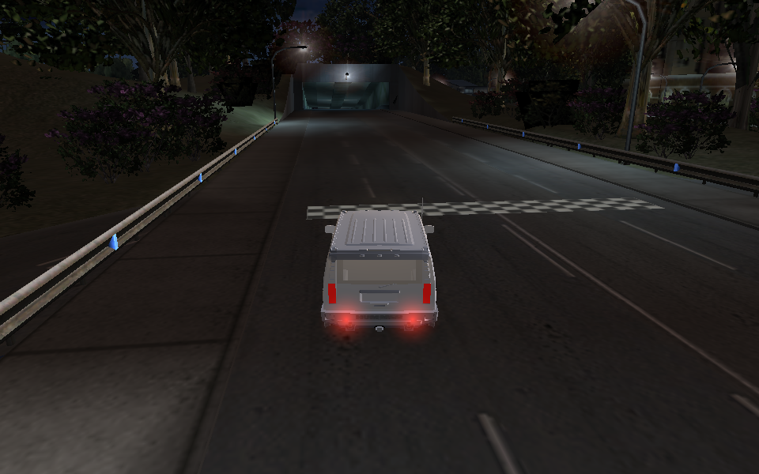
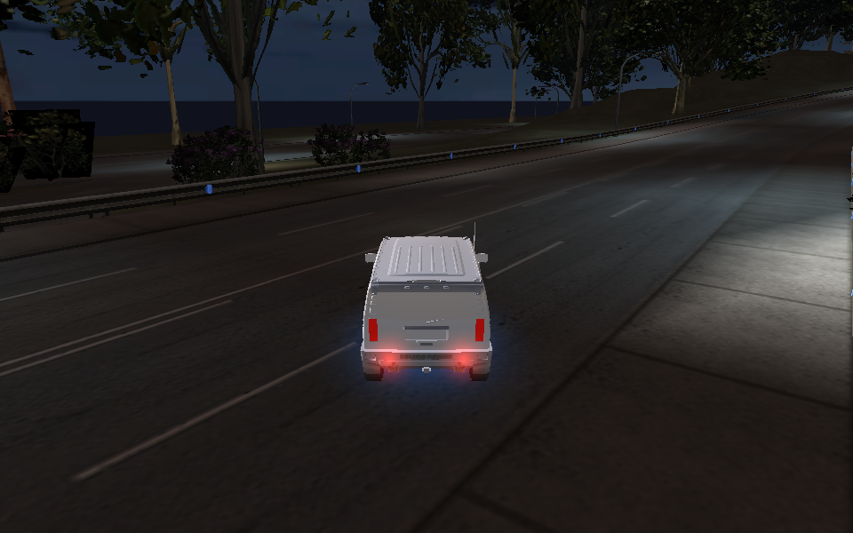
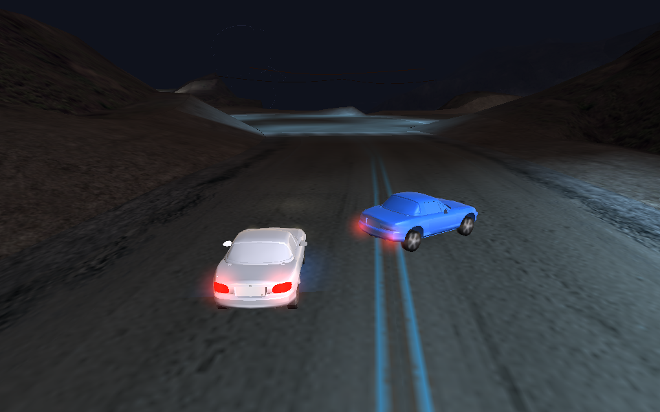
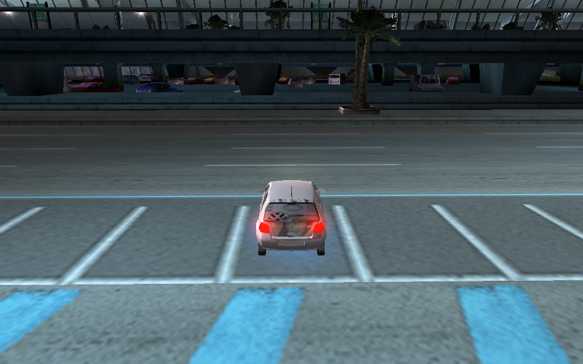

# OpenUG2 runtime gallery

These captures come from the verified runtime audit frames kept with the
project. They are intentionally unedited: the repository is an engine
prototype, so the images show both the recovered city scale and the current
vehicle/lighting state.

| Capture | What it shows |
| --- | --- |
|  | MIATA on a real L4RA route with authored signage, barriers and lane materials |
|  | Open-world city driving under the recovered night lighting |
|  | HUMMER sprint start on the L4RB route |
|  | Road, guardrail, foliage and lighting composition in the open-world bundle |
|  | Player and opponent vehicle test on the recovered road surface |
|  | Close vehicle view used while validating body, glass, lights and wheel materials |
