# OpenUG2 runtime gallery

These captures come from the verified runtime audit frames kept with the
project. They are intentionally unedited: the repository is an engine
prototype, so the images show both the recovered city scale and the current
vehicle/lighting state.

| Capture | What it shows |
| --- | --- |
| 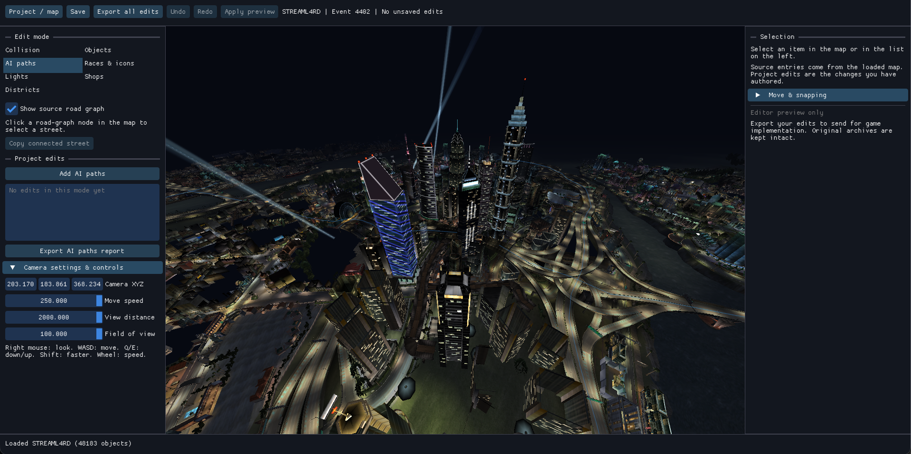 | Bayview overview with ImGui collision, object, AI-path and event authoring controls |
| 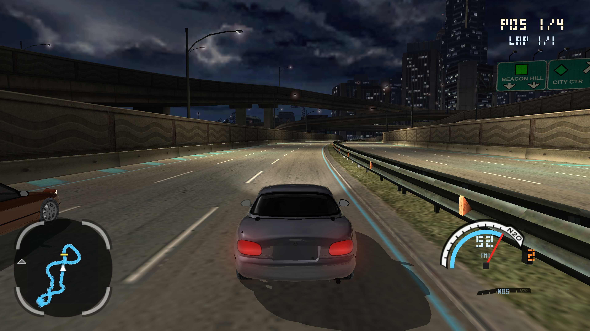 | MIATA in event 4083 with AI opponent, road lighting and prototype HUD; native 3840×2160, tick 300, high vehicle detail |
| 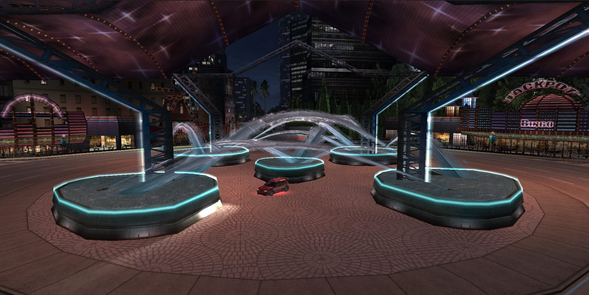 | Plaza, fountain geometry and surrounding buildings; water animation remains work in progress |
| 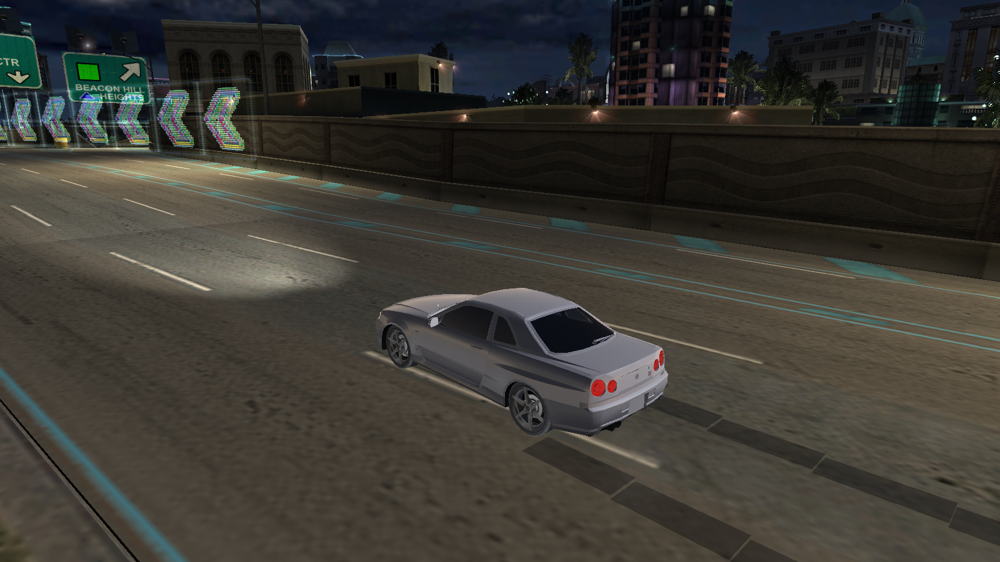 | Skyline body, glass, wheels and lamp presentation |
| 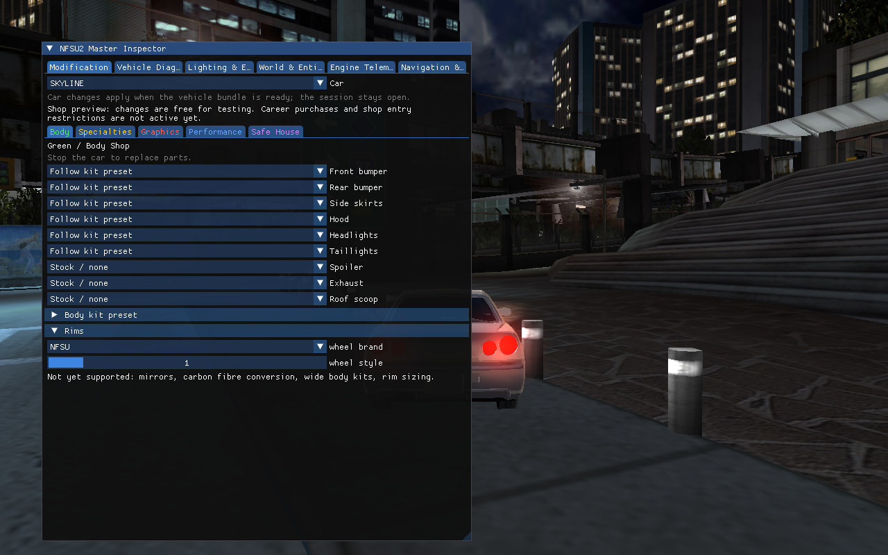 | ImGui body-shop modification controls |
| 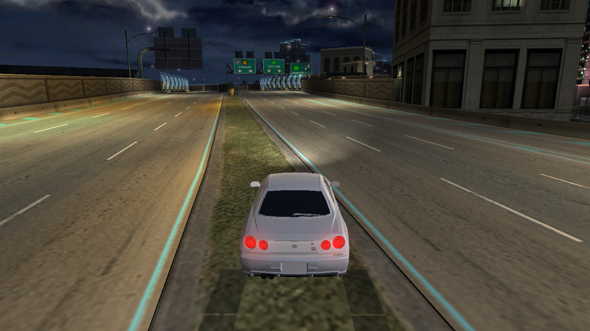 | Road scene with 16× texture filtering |
| 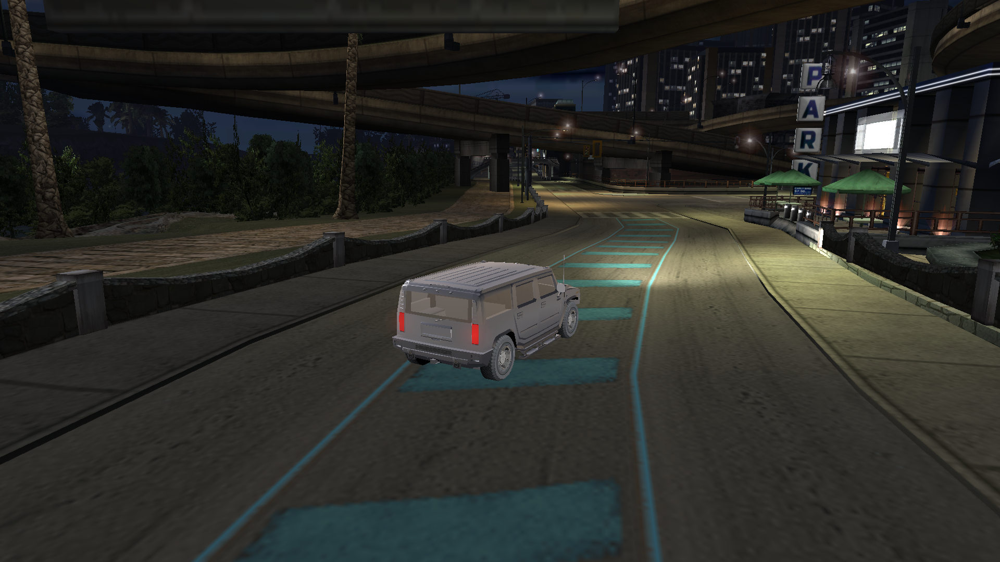 | Lighting near a parking entrance |
| 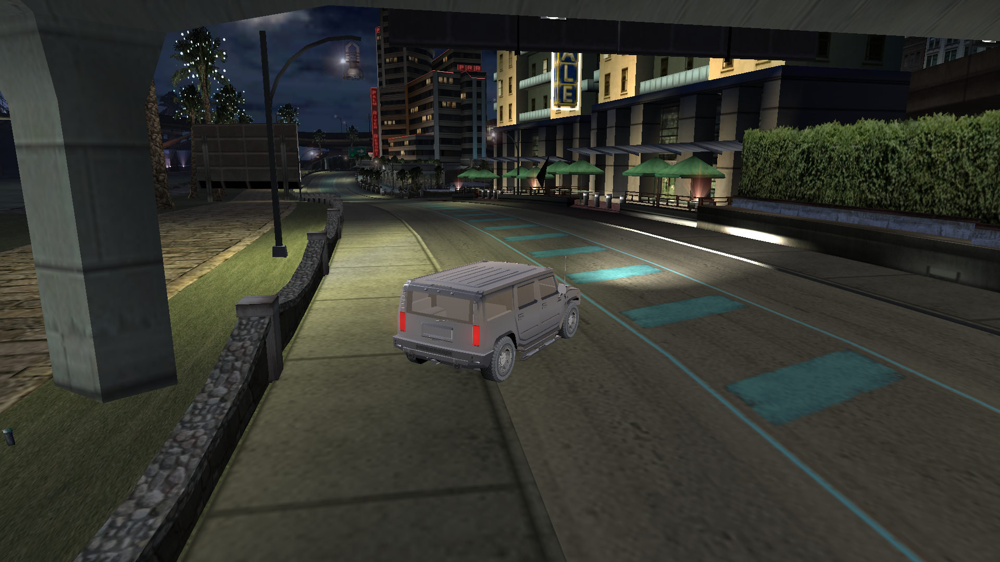 | Lighting along the road and building fronts |
| 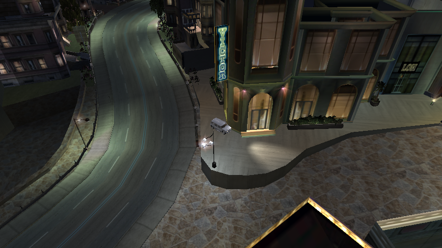 | Building sign, pavement and road materials |
| 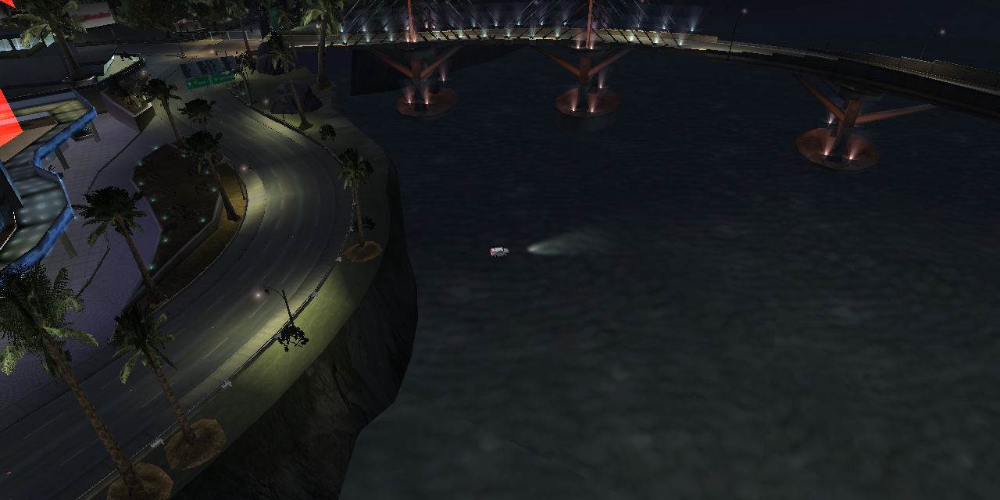 | Current water surface, bridge and waterfront geometry |
| 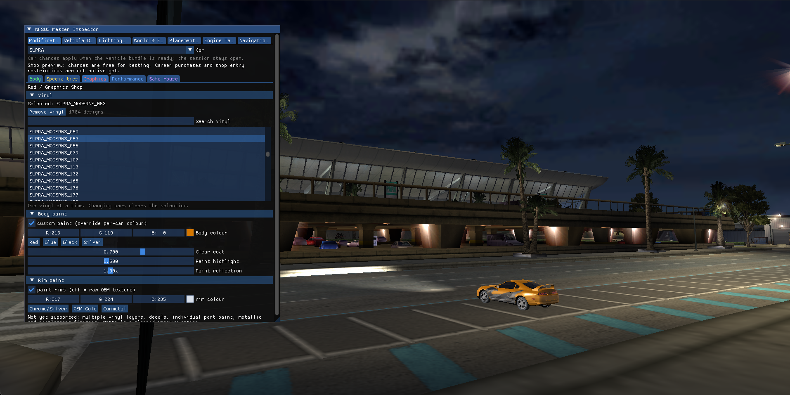 | Supra with a selected vinyl in the Red / Graphics shop |
